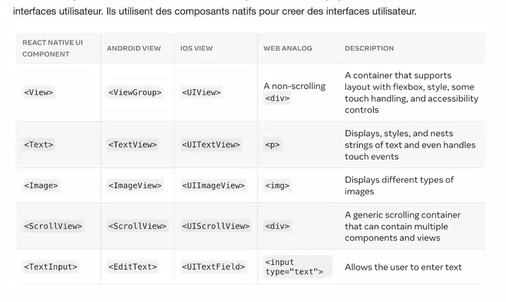

# Cours React Native

## Création d'un nouveau projet avec Expo

```sh
npx create-expo-app nameProject --template blank
```

## Qu'est ce que expo 

#### Les vues et le dev mobile

La vue est la brique de base de l'interface de l'utilisateur dans React Native.

#### Structure de l'application

- App : Contient les éléments de navigation (file,based, routing). La structure du dossier de l'app qui détermine la navigation de l'application.
- Components: Contient tous les composants de l'applications qui ne sont pas destinées à être des écrans. 
- constants : Contient les constantes de l'applicatoins.
- Hooks : Contient les hooks custom de l'application
-app.json : Contient la configuration de l'application.
-babel.config.js : contient la configuration de babel.

### Expo CLI

Le CLI expo vous permet de lancer votre applicatoin, de la déployer, de la build, de la déployer, de la publier etc..

### EAS Cli

EAS est un service de build et de déploiement d'Expo. Il permet de build des applicatoins plus rapidement et de les déployer sur les stores.

```sh
npm install -g eas-cli
```

### Expo Router : 

Expo router est un router pour React Native qui permet de naviguer entre les écrans de l'application en utilisant le syst-me de fichier (Dimilaire a Next.js)

```sh
npx expo install expo-router react-native-safe-area-context react-native-screens expo-linking expo-constants expo-status-bar
```

### Package.json 

Une ligne de code doit être modifié dans le fichier package.json 

```sh
"main": "expo-router/entry.js",
```
### Les composants de base :

React Native est un framework qui permet de créer des applications mobiles multiplateformes en utilisant React. Il est basé sur les composants de React.

Les cores components de React Native sont des composants de base qui permettent de créer des interfaces utilisateurs. Ils utilisent des composants natifs pour créer des interfaces utilisateur.



### En cas de modifications majeure (ajout de dépendances ,etc...):

```sh
npx expo start -c
```
